<h1 align="center"></h1>
<br>


```lua
grantghk@github README.md ~ % fetchneo
------------------------------------------------------------
OS         : Win 11 Pro, macOS 26 Tahoe, Ubuntu 24.04 LTS
Host       : GitHub
Kernel     : GRANTGHK 1.0T
Uptime     : Since 2021
Location   : Thailand
Time Zone  : GMT+7
Editor     : VS Code 
Languages  : TypeScript, JavaScript, Python, Lua, C++
Frameworks : Discord.js, Flask, FastAPI, Node.js, React, Next, and More!
Database   : MongoDB, Redis, SQLite, MySQL, Postgres
Cloud      : Cloudflare, Docker
Tools      : Git, Figma
Interests  : Everything in coding
Learning   : Rust, Go
Status     : Studying in High School
```

<h1 align="center"></h1>
<br>
<p align="center">
  
  
  
</p>

<h1 align="center"></h1>
<br>
<p align="center"> 
   
   
</p> 

<h1 align="center"></h1>
<br>
<p align="center"> 
   
   
  <a href="mailto:grantghk@gmail.com">
    
  </a> 
  <a href="https://discord.com/users/924259129508376616">
      
  </a> 
</p>
<p align="center"> 
  
</p>
